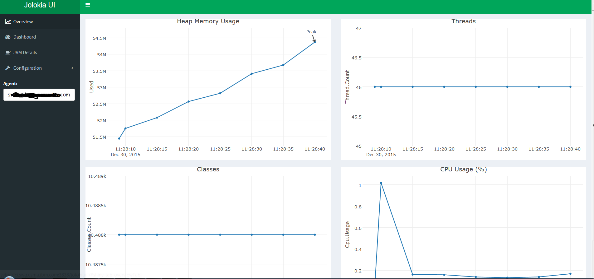
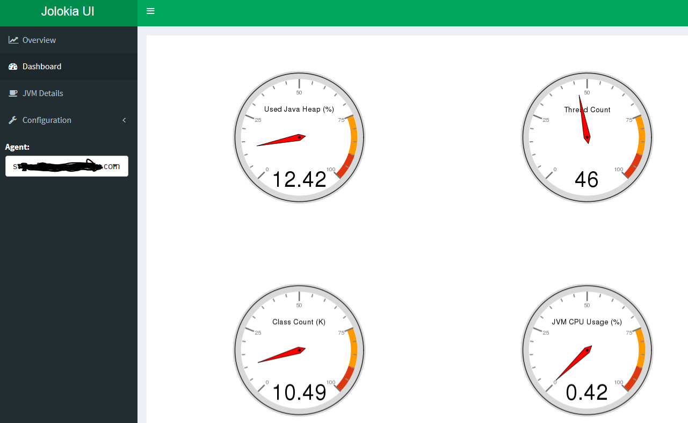
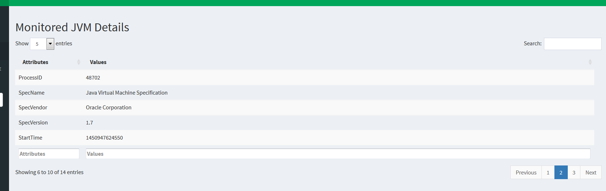
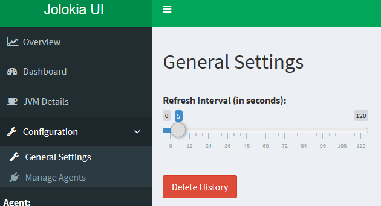
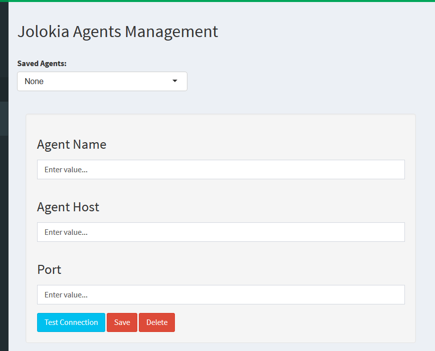

# jolokiaui  
  
A web client for the Jolokia JVM agent (https://jolokia.org/agent/jvm.html) implemented in R (https://www.r-project.org/) using the Shiny framework (http://shiny.rstudio.com/).  
  
## What's Jolokia  
Jolokia (https://jolokia.org/) is an HTTP/JSON bridge for remote JMX access. It is an alternative to standard JSR 160 connectors, using an agent based approach. The clients communicate with the agent over HTTP (GET or POST) with the request and response payload represented in JSON. It transparently bridges to the JMX world, talking to clients on the frontend via a REST-like protocol and to a JMX.   
  
## Jolokia UI  
Jolokia UI is a web client to monitor local and remote JVMs through Jolokia JVM agents. It is totally implemented in R and it is based on the Shiny framework. It uses the plotly library for R (https://plot.ly/r/) to render the time series charts and the dial.plot library provided by togaware (http://onepager.togaware.com/dial.plot.R) to render the gauge charts. I have included the source code of the dial.plot library in the project for performance reasons, but it will be replaced next by a custom implementation made by me. The monitoring (Jolokia agent + UI) has been tested using Oracle and IBM JDKs/JVMs 1.6+.
  
### Features  
The current release comes with the following:  
* Graphical rendering (time series and gauge charts) of the used heap memory, thread count, loaded classes and CPU usage for a local or remote JVM monitored through a Jolokia agent  
* Zoom and pan of all of the time series charts  
* Export to PNG images of all of the time series charts   
* Details table of the JVM under monitoring  
* Refresh interval setting  
* History deletion  
* Multiple Jolokia JVM agents management (add, update, remove, connection testing)
  
## Installation  
Jolokia UI is a Shiny web application, so it needs to be deployed in a on-prem Shiny Server (https://www.rstudio.com/products/shiny/shiny-server/) or hosted in shinyapps.io cloud (http://www.shinyapps.io/). You can find instruction on how to install the Shiny Server Open Source edition in my personal blog (http://googlielmo.blogspot.ie/2015/09/quick-guide-to-install-shiny-server.html and http://googlielmo.blogspot.ie/2015/10/shiny-server-open-source-edition.html).  
Identify the directory to host the Shiny applications for your Shiny Server instance (it is identified by the *site_dir* property in the */etc/shiny-server/shiny-server.conf* file). Create a sub-directory and name it *jolokiaui* (you can use any name you like for it any way).  Then copy all of the .R files of the project there and set the read, write and execute permissions for the directory and the files for the user running your Shiny Server instance. If everyting is fine you should access the application through a web browser at the following URL: *http://hostname:shiny-server-listening-port/jolokiaui/*  

## Screenshots  
Overview:  
  
  
Dashboard:  
  
  
JVM details:  
  
  
General Settings:  
  
  
Agents Management:  
  
  
## Releases  
At present time only the 0.2 release is available.    

